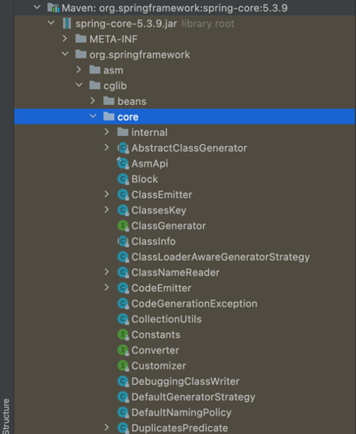

# Maven

## 학습목표

- **Maven의 역할과 사용하는 이유를 이해한다.**
    - 빌드 도구(Build Tool)의 개념과 Maven이 프로젝트에서 어떤 역할을 하는지 설명할 수 있다.
    - Maven을 사용하면 라이브러리 관리, 빌드 자동화, 의존성 관리가 왜 쉬워지는지 이해한다.
- **Maven 기본 구조(POM.xml 파일)의 의미를 이해한다.**
    - groupId, artifactId, version 등의 기본 개념을 설명할 수 있다.
    - dependencies, plugins, repositories의 기본적인 역할을 이해한다.
- **Maven 의존성(Dependencies)을 추가하고 관리하는 방법을 익힌다.**
    - POM.xml 파일에 라이브러리를 추가하고, 자동으로 다운로드 및 관리하는 방법을 습득한다.
- **Maven 빌드 및 테스트 명령어를 사용할 수 있다.**
    - mvn clean, mvn compile, mvn test, mvn package 등의 기본 명령어를 사용할 수 있다.
- **Maven을 이용한 프로젝트 구조와 표준 디렉토리 구조를 이해한다.**
    - src/main/java, src/test/java 등의 폴더가 가지는 의미를 설명할 수 있다.

# JSON과 XML

공통점

- 데이터를 저장하고 전달하기 위해 고안되었다.
- 기계뿐만 아니라 사람도 쉽게 읽을 수 있다.
- 계층적인 데이터 구조를 가진다.
- 다양한 프로그래밍 언어에 의해 파싱될 수 있다.
- XMLHttpRequest 객체를 이용하여 서버로부터 데이터를 전송받을 수 있다.

XML: EXtensible Markup Language

```xml
<member>
    <name>마르코</name>
    <id>marco<id>
    <age>31</age>
    <weight>70</weight>
</member>
```

JSON: JavaScript Object Notation

```json
{
    "name": "마르코",
    "id": "marco",
    "age": 31,
    "weight": 70
}
```

# Package: class들의 모음

고유성

- package를 사용하는 이유는 클래스명의 고유성을 보장하기 위해서 사용한다.
- 만약 다른 java 프로그래머가 협업과정에서 서로 다른 목적을 가진 클래스를 생성했는데 이름이 같다고 가정할 때, 서로 다른 패키지를 사용함으로써 충돌을 피할 수 있다.

최상위 패키지명은 도메인

- 최상위 패키지명에 도메인 주소를 앞뒤로 바꿔서 사용한다.
- 이미 인터넷 도메인은 고유성을 가지고 있으므로 충돌에 대해 걱정할 필요가 없다.대해

GSON: json관련해서 google에서 제공해주는 라이브러리

- 자바 객체를 JSON 표현으로 변환하는데 사용할 수 있는 자바 라이브러리
- JSON 문자열을 동등한 자바 객체로 변환하는데에도 사용할 수 있다.

GSON을 제외한 JSON 변환 오픈소스 프로젝트가 있는데 이들은 어노테이션을 배치해야 동작한다.

또한 대부분은 제네릭의 사용을 완전히 지원하지 않는다.

GSON은 이 2가지 모두를 매우 중요한 디자인 목표로 간주한다.

폴더 형식의 package 구조

- springframework 패키지 구조
- 폴더 구조 형태로 계층적으로 구성되어 있음
- org.springframework.spring-core



package 사용하는 방법

1. 직접 package주소를 명시
2. import
3. static import 

# jar: java에서 제공하는 압축 파일, zip 압축

- class 파일, resource(텍스트, 이미지) 등등 메타데이터를 하나로 모아서 Java 플랫폼의 응용소프트웨어나 라이브러리를 배포하기 위한 소프트웨어 패키지 파일
- 컴파일된 class 파일을 jar 묶어서 배포하면 경로나 파일의 위치에 상관없이 프로그램 실행 가능

# Maven

clean

- 프로젝트를 정리하고 이전 빌드에서 생성된 모든 파일을 제거한다.
- project_root/target 삭제한다

vallidate

- 프로젝트의 상태를 점검하고, 필드에 필요한 정보의 존재 여부를 체크한다.
- 프로젝트의 POM 및 구성을 검증한다.

compile

- 프로젝트의 소스 코드를 컴파일한다.

test

- 프로젝트에 대한 테스트를 실행한다.

package

- 프로젝트에 대한 JAR 또는 WAR 파일을 생성하여 배포할 수 있는 형식으로 변환한다.

# Dependency Scope

```xml
    <!-- https://mvnrepository.com/artifact/org.junit.jupiter/junit-jupiter-api -->
    <dependency>
      <groupId>org.junit.jupiter</groupId>
      <artifactId>junit-jupiter-api</artifactId>
      <version>5.12.2</version>
      <scope>test</scope>
    </dependency>
```

compile

- default scope
- 모든 상황에 포함된다.

provided

- compile과 유사하게 모든 상황에 포함되어 수행되지만 package단계에서 포함하지 않는다.
- 즉 배포환경(실행환경)에서 해당 Library를 제공한다.

runtime

- compile시 불필요하지만 runtime시 필요할 경우
- 즉 runtime 및 test할 때 classpath에 추가되지만, compile 시 추가되지 않음

test

- test시에만 사용
- junit

system

- provided와 유사하지만 maven의 central repository를 사용하지 않는다.
- 즉, system내의 특정 path를 지정하여 참조

```xml
<dependency>
    <groupId>com.nhnacademy.hello.util</groupId>
    <artifactId>calculator</artifactId>
    <version>1.0.0</version>
    <scope>system</scope>
    <systemPath>${project.basedir}/lib/calculator.jar</systemPath>
</dependency>
```