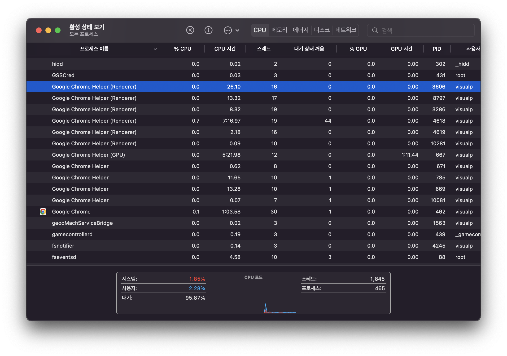

# thread

### **1. 멀티스레딩의 이해**

- 자바에서 멀티스레딩의 개념과 필요성을 이해한다.
- 멀티스레딩의 장점과 단점을 설명할 수 있다.
- 스레드의 생명 주기와 상태 변화를 이해한다.

### **2. 스레드 생성 및 관리**

- `Thread` 클래스와 `Runnable` 인터페이스를 사용하여 스레드를 생성하고 관리하는 방법을 학습한다.
- 스레드의 우선순위 설정과 스케줄링에 대해 이해한다.

### **3. 동기화와 스레드 안전성**

- 동기화의 필요성과 개념을 이해한다.
- `synchronized` 키워드와 메소드, 블록을 사용하여 임계 구역을 보호하는 방법을 학습한다.

### **4. 스레드 간 통신**

- `wait()`, `notify()`, `notifyAll()` 메소드를 사용하여 스레드 간 통신을 구현하는 방법을 학습한다.
- `BlockingQueue`와 같은 스레드 안전한 데이터 구조를 사용하여 스레드 간 데이터를 교환하는 방법을 이해한다.

Process(프로세스)

- 단순 생각해서 프로그램이 실행시킨 인스턴스
- 프로세스(Process)란 컴퓨터에서 연속적으로 실행되고 있는 컴퓨터 프로그램을 말합니다. 종종 스케줄링의 대상이 되는 작업(Task)과 같은 용어로 쓰인다.
- 프로그램은 일반적으로 보조 기억 장치에 저장된 실행 코드를 뜻하고, 프로세스는 프로그램을 구동하여 프로그램 자체와 프로그램의 상테가 메모리에서 실행되는 작업 단위를 지정한다.
- 하나의 프로그램을 여러 번 실행하면 프로세스가 메모리 상에서 실행된다.
- 같은 시간에 여러 개의 프로그램을 실행하는 시분할 방식을 멀티 태스킹이라고 하며, 대부분의 운영체제는 시분할 방식을 지원합니다. 프로세스 관리는 운영체제의 중요한 부분이다.



Process Scheduling(프로세스 스케줄링)

- 컴퓨터의 CPU는 한정되어 있고, 대부분의 경우 프로세스는 CPU보다 많다.
- CPU 할당 순서 및 방법을 결정하는 일

Process Scheduling 방식

- Non-preemptive(비선점형) - 프로세스가 스스로 다음 프로세스에 자리를 넘겨주는 방식
- Preemptive(선점형): 운영체제가 강제로 프로세스의 사용권을 통제하는 방식

Process Scheduling Algorithm

- FCFS(First Come First Serve)
    - CPU에 먼저 도착하는 순서대로 프로세스를 할당하는 방식으로 , 각 작업이 종료될 때까지 CPU를 빼앗지 않으므로 Non-preemptive 방식이며, FIFO방식의 Queue와 동일하게 동작한다.
- SJF(Short Job First)
    - 프로세스의 수행 시간이 짧은 순서대로 프로세스를 할당하는 방식으로 항상 주어진 프로세스에 대해 최소의 평균 대기 시간을 보장한다. 수행 시간이 긴 프로세스는 계속 뒤로 밀리는 기아(starvation) 현상이 발생할 수 있으며, 각 프로세스가 얼마나 CPU를 사용할지 모르는 경우 사용하기 어렵다.
- Round Robin
    - 각 프로세스가 동일한 크기의 할당 시간을 갖고 할당 시간이 끝나면 자동으로 선점(Preemptive)당하고, Ready Queue의 제일 뒤로 할당된다. n 개의 프로세스가 Ready Queue에 존재하고 할당 시간이 q라면 어떤 프로세스도 (n-1)q 이상 기다리지 않으므로 기아 현상이 발생하지 않는다.
- Priority Processing
    - 특정 기준으로 프로세스에 우선순위를 부여해 우선순위가 제일 높은 프로세스에 CPU를 할당하는 방식의 스케줄링이다.
    - 우선순위가 낮은 프로세스는 기아 현상이 발생할 수 있는데, 오래 대기한 프로세스의 우선순위를 높이는 에이징 방식으로 해결한다.
- MLFQ, HRN 등 여러 프로세스 스케줄링 기법이 있다.

Process 상태변화

- 프로세스는 ready, running, blocked의 상태를 가지며 스케줄러와 다른 요인에 따라 상태가 변화한다.
- 하나의 프로그램이 실행되면 그 프로그램에 대응하는 프로세스가 생성되어 ready 리스트의 끝에 들어간다.
- ready 리스트 상의 다른 프로세스들이 CPU를 할당받아 ready 리스트를 떠나면 프로세스는 리스트의 앞으로 이동하고 CPU를 사용할 수 있게 된다.


Dispatch

- ready 리스트의 맨 앞에 있던 프로세스가 CPU를 점유하게 되는 것, 즉 준비 상태에서 실행 상태로 바뀌는 것을 디스패치라고 한다.

Block

- 실행 상태의 프로세스가 허가된 시간을 다 쓰기 전에 입출력 동작이 필요한 경우 프로세스는 CPU를 스스로 반납하고 보류 상태로 넘어간다.

Wakeup

- 입출력 작업 종료 등 기다리던 사건이 일어났을 때 보류 상태에서 준비 상태로 넘어간다.

Timeout

- 운영체제는 프로세스가 프로세서를 계속 독점해서 사용하지 못하게 하기 위해 clock interrupt를 두어서 프로세스가 일정 시간동안만 (시분할 시스템의 time slice) 프로세서를 점유할 수 있게 한다.

# Thread

- 스레드(Thread)란 프로세스 내에서 실행되는 여러 개의 실행 단위로, 경량화 프로세스라고 부르기도 합니다.
- 한 프로그램은 하나의 Thread에서 실행되지만, 프로그래밍 환경에 따라서 하나 이상의 스레드를 실행할 수 있다.
- 한 프로세스 내에서 동작하는 여러 실행 흐름으로 프로세스 내의 주소 공간이나 자원을 공유할 수 있다.
- 각각 thread는 독립적인 작업을 수행함으로 각자의 stack과 pc register 값을 가진다.

스레드의 특징

- 독립된 stack
    - stack은 method 호출 시 전달되는 인자, 되돌아갈 주소 값 등을 저장하기 위해 사용되는 메모리 공간
    - 즉 stack 메모리가 독립적으로 동작함으로써 독립적은 함수 호출이 가능하며 독립적인 실행 흐름을 가져갈 수 잇다.
- 독립적인 할당 PC Register
    - register 값은 thread 명령어의 어디까지 수행했는지 기억하고 있다.
    - thread는 CPU를 할당받았다가 스케줄러에 의해서 다시 선점당하게 된다.
    - 그렇기 때문에 명령이 연속적으로 수행되지 못하고 일정 부분 수행 후 다시 수행하기 위해서는 어느 부분까지 수행했는지 기억해야 한다. 그래서 PC Register를 독립적으로 할당한다.

thread 생성

- Thread 클래스 상속
- Runnable 인터페이스 구현(권장)
    - 다른 클래스를 상속해야 하는 클래스 구현 시 유리함
    - 재사용성이 높고 코드의 일관성을 유지할 수 있는 장점


# Main thread

- java 프로그램을 실행하면 하나의 스레드가 즉시 실행되기 시작한다. 이를 Main thread라고 한다.
- 프로그램 시작과 동시에 자동으로 생성되는 기본 thread이다.

특징

- 다른 자식 스레드들의 부모 스레드 역할을 한다.
- 프로그램의 시작점이자 마지막 실행을 완료하는 스레드이다.
- 다양한 종류의 작업을 순차적으로 수행한다.

제어방법

- Thread.currentThread() 메소드를 호출하여 현재 실행 중인 Thread의 참조를 얻을 수 있다.


Daemon thread

- 데몬 스레드는 메인 스레드의 작업을 돕는 보조적인 스레드이다.
- 주 스레드가 종료되면 자동으로 함께 종료된다.

특징

- setDaemon(true) 메소드로 데몬 스레드로 설정할 수 있다.
- 가비지 컬렉션, 자동 저장 등 백그라운드 작업에 주로 사용된다.
- 주 스레드가 종료되면 강제적으로 종료된다.

사용 예시

- 모니터링 스레드
- 주기적인 자동 저장
- 로그 처리

Thread.sleep

쓰레드의 동작을 일정시간 유예하고, CPU가 다른 작업을 할 수 있도록 허용하는 함수이다. 해당 함수가 실행되면 쓰레드는 TIMED_WAITING 상태로서 일시 정지 상태가되며, 명시한 시간이 지난 후 RUNNABLE을 거쳐 작업실행을 하게 된다.

이 때, sleep전에 가지고 있던 monitor lock은 잃지 않으므로 sleeptime이 지난 후 진행중이던 작업을 바로 실행할 수 있다. 쓰레드를 일시정지 시키면 해당 쓰레드의 CPU 사용이 없어지며 전체 CPU 사용량이 감소할 수 있고, CPU과열 등을 예방할 수 있다.

busy waiting

When a thread repeatedly checks a condition within a loop and calls Thread.sleep() to pause for a short duration between checks.

공유자원의 권한을 얻는 방법 중 하나, 공유 자원의 경우, 한 시점에 하나의 스레드만 접근을 해야 경쟁 상태를 만들지 않기 때문에 이에 대한 방법이 필요하다. 

무한 루프를 계속 돌면서 공유 자원의 점유 가능성을 확인하는 방식이 busy waiting 이다. 

흔히 말하는 polling 방식의 단점을 가지고 있으므로, 해당 방법보다는 뮤텍스 세마포어를 사용해야 한다.

While Thread.sleep() does relinquish CPU time, the fundamental problem is that the thread is still activelypolling for a change rather than being notified when the change occurs.

# Single thread

- Main 스레드에서 작업 진행, 작업이 순차적으로 진행됨
- 하나의 프로세스에서 오직 하나의 스레드로만 실행
- 단일 레지스터와 스택으로 구성
- Context Switching 작업을 요구하지 않음
- 동시성 제어에 대한 처리를 신경쓰지 않아도 됨

Context Switching

- CPU에서 실행중이던 스레드가 다른 스레드로 교체되는 것
    - 이때 두 스레드는 같은 프로세스에 속할 수도, 다른 프로세스에 속할 수도 있다.
- 여러 프로세스/스레드를 동시에 발생시키기 위해 필요하다.

발생 원인

- Time Quato Expiry: 주어진 quantum(time slice)의 시간이 다됨, 쉽게 말해 time over
- interrupt: 커널 함수를 통해서 프로그램 실행 도중에 멈춰버림(SIGKILL interrupt signal)
- Preemption: 더 우선순위가 높은 일을 해야 할 때 선점해버려서


컨텍스트(Context)란?

- 프로세스/스레드의 상태
    - CPU, 메모리의 상태 등

컨텍스트 스위칭의 과정

컨텍스트 스위칭은 OS 커널이 실행한다. OS 커널은 리소스를 관리, 감독하는 역할을 한다.

설명을 위해, 컨텍스트 스위칭을 통해서 CPU에서 실행되던 스레드1 > 스레드2로 교체된 상황이라고 하자.

먼저, 아래 내용은 기본적으로 일어나게 된다.

컨텍스트 스위칭 기본 작업

- 커널 모드로 전환
    - 프로세스에서 통제권이 넘어가 커널에서 실행
    - 하드웨어와 밀접한 일, 혹은 컴퓨터의 리소스를 사용해야 하는 일(컨텍스트 쉬이칭에 필요한 일)
- CPU의 register 상태 교체
    - 각종 명령어를 실행하기 위해 필요한 데이터를 저장하는 register의 상태 교체
    - 스레드1의 레지스터 상태를 저장해야 어디까지 실행되었는지 등 상태 정보를 기억해서 다시 컨텍스트 스위칭 때 활용할 수 있음.


이때 스레드1, 스레드2가 속하는 프로세스가 동일한지, 다른지에 따라서 스위칭 과정이 달라진다.

- 프로세스1의 스레드1 > 프로세스2의 스레드2 = Process Context Switching
- 프로세스1의 스레드1 > 프로세스1의 스레드2 = Thread Context Switching

Thread Context Switching

기본 작업만 하면 된다. ⇒ 빠르다

커널모드 전환 + CPU register 상태 교체


Process Context Switching

가상 메모리 주소 관련 처리를 추가로 수행해야 한다.

1. MMU(Menory Management Unit)이 새로운 프로세스의 주소 체계를 바라보도록 수정
2. 캐시 역할을 하는 TLB(Translation Lookaside Buffer)를 완전히 비워줘야 함.

커널모드 전환 + CPU register 상태 교체 + 가상 메모리 주소 처리(MMU 수정 + TLB 캐시 비우기)


캐시 오염(Cache Pollution)

CPU 내부에 캐시를 위한 공간이 있는데, 컨텍스트 스위칭을 하면 캐시의 데이터가 현재 실행중인 스레드의 데이터가 아닐 수 있다. 컨텍스트 스위칭직후에는 캐시에 필요한 데이터가 없어서, 메모리에 접근해 데이터를 받아와야 하기 때문에 성능에 안좋은 영향을 줄 수 있다.

애플리케이션 관점에서, 컨텍스트 스위칭은 오버헤드

결론

Process Context Switching 과정 = **커널 모드 전환** + **CPU register 상태 교체** + 가상 메모리 주소 처리(**MMU 수정** + **TLB 캐시 비우기**)

Thread Context Switching 과정 = **커널 모드 전환** + **CPU register 상태 교체**

⇒ 스레드 컨텍스트 스위칭이 더 빠르다!

컨텍스트 스위칭 = Pure Overhead

Single Thread의 장점

1. 자원 접근 동기화 불필요
    1. 여러 개의 스레드가 프로세스의 자원을 공유하면, 각 스레드가 자원 접근에 대해서 접근 제어를 해야한다.
    2. 모든 스레드가 자원에 동시에 접근하거나, 동일한 작업을 실행하면 Exception이 발생한다.
    3. Single Thread 환경에서는 동기화에 대해서 고려할 필요가 없다.
2. Context Switching 작업 불필요
    1. 현재 진행하고 있는 Task(Process, Thread)의 상태를 저장하고 다음 진행할 Task의 상태 값을 읽어 적용하는 과정을 말한다.
    2. Multi-Thread 환경에서는 Context Switching을 통해서 실시간처럼 보이게 처리한다.
    3. Single Thread 에서는 Context Switching 필요하지 않음으로 Context Switching에 대한 비용이 발생하지 않는다.
3. 효율적인 계산 작업 처리
    1. 단순 계산 작업의 경우 Multi-Thread 환경에서는 context-switching 오버헤드가 발생하므로, single-thread 방식이 더 효율적일 수 있다.
    2. 특히 간단한 연산의 경우, multi-thread 환경의 context switching 비용이 계산 처리 시간보다 더 커질 수 있어 single thread가 유리하다.
4. 개발 용이성과 리소스 효율성
    1. 개발 난이도가 쉽고, CPU, Memory를 적게 사용한다.(사용 비용을 줄일 수 있다.)

Single Thread의 단점

1. 하드웨어 활용 제한
    1. Multi CPU를 활용하지 못한다.
2. 작업 처리의 제약
    1. 연산량이 많은 작업의 경우 그 작업이 완료되어야 다음 작업을 진행할 수 있다.
3. 에러 처리의 취약성
    1. 싱글 스레드는 치명적인 에러가 발생하면 전체 애플리케이션이 중지될 수 있다.
    2. 다른 스레드로 작업ㅇ르 전환하거나 복구할 수 있는 Multi-Thread 방식과 달리, 에러가 발생한 경우 프로그램 전체가 영향을 받는다.

Thread run vs start?

```java
public class ExtendThread extends Thread {

    @Override
    public void run() {
        System.out.println("Thread 클래스 상속");
    }
}

class ExtendThreadTest {

    public static void main(String[] args) {
        Thread thread = new ExtendThread();
        thread.start();
    }
}
```

상속을 통해 Thread를 생성하고 시작하는 방식에 대한 예제이다.

궁금한 점: run() 메소드를 재정의 했는데 사용할 때는 start() 메소드를 호출한다.

```java
    private Runnable target;

    /**
     * If this thread was constructed using a separate
     * {@code Runnable} run object, then that
     * {@code Runnable} object's {@code run} method is called;
     * otherwise, this method does nothing and returns.
     * <p>
     * Subclasses of {@code Thread} should override this method.
     *
     * @see     #start()
     * @see     #stop()
     * @see     #Thread(ThreadGroup, Runnable, String)
     */
    @Override
    public void run() {
        if (target != null) {
            target.run();
        }
    }
```

```java
   /**
     * Causes this thread to begin execution; the Java Virtual Machine
     * calls the {@code run} method of this thread.
     * <p>
     * The result is that two threads are running concurrently: the
     * current thread (which returns from the call to the
     * {@code start} method) and the other thread (which executes its
     * {@code run} method).
     * <p>
     * It is never legal to start a thread more than once.
     * In particular, a thread may not be restarted once it has completed
     * execution.
     *
     * @throws     IllegalThreadStateException  if the thread was already started.
     * @see        #run()
     * @see        #stop()
     */
    public synchronized void start() {
        /**
         * This method is not invoked for the main method thread or "system"
         * group threads created/set up by the VM. Any new functionality added
         * to this method in the future may have to also be added to the VM.
         *
         * A zero status value corresponds to state "NEW".
         */
        if (threadStatus != 0)
            throw new IllegalThreadStateException();

        /* Notify the group that this thread is about to be started
         * so that it can be added to the group's list of threads
         * and the group's unstarted count can be decremented. */
        group.add(this);

        boolean started = false;
        try {
            start0();
            started = true;
        } finally {
            try {
                if (!started) {
                    group.threadStartFailed(this);
                }
            } catch (Throwable ignore) {
                /* do nothing. If start0 threw a Throwable then
                  it will be passed up the call stack */
            }
        }
    }
```

위의 코드를 보면 start는 크게 다음과 같은 과정으로 진행된다.

1. 스레드가 실행 가능한지 검사함
2. 스레드를 스레드 그룹에 추가함
3. 스레드를 JVM이 실행시킴

run() 메소드

- Thread 클래스에서 재정의해 실행할 작업을 정의한다.
- 이 메소드를 직접 호출하는 것은 단순한 메소드 호출일 뿐 스레드를 추가로 할당하지 않는다. 즉, 현재 스레드(run()을 호출한 스레드)에서 작업을 수행한다. 그래서 실행 흐름을 차단한다.
- Runnable 타입의 멤버 변수 target의 run() 메소드를 호출한다.
- Runnable 인터페이스의 run() 메소드 호출만 하고 끝난다.

start() 메소드

- start() 메소드는 새로운 스레드를 생성하고 생성한 스레드에서 run() 메소드를 비동기적으로 실행한다.
- 결과적으로 두 개의 스레드가 동시에 실행된다. 스레드를 두번 이상 시작하는 것이 허용되지 않는다.

[Thread 클래스]

Thread는 스레드 생성을 위해 java에서 미리 구현해둔 클래스이다. Thread는 기본적으로 다음과 같은 메소드들을 제공한다.

- sleep
    - 현재 스레드 멈추기
    - 자원을 놓아주지는 않고, 제어권을 넘겨주므로 데드락이 발생할 수 있음
- interrupt
    - 다른 스레드를 깨워서 InterruptException을 발생시킴
    - Interrupt가 발생한 스레드는 예외를 catch하여 다른 작업을 할 수 있음
- join
    - 다른 스레드의 작업이 끝날 때까지 기다리게 함
    - 스레드의 순서를 제어할 때 사용할 수 있음.

Runnable 인터페이스는 1개의 메소드 만을 갖는 함수형 인터페이스이다. 그렇기 때문에 람다로도 사용 가능하다.

```java
@FunctionalInterface
public interface Runnable {

    public abstract void run();
    
}
```

아래는 스레드를 구현하기 위한 템플릿에 해당하는데, 해당 인터페이스의 구현체를 만들고 Thread 객체 생성 시에 넘겨주면 실행 가능하다. Thread 클래스는 반드시 run 메소드를 구현해야 했는데, Thread 클래스가 Runnable를 구현하고 있기 때문이다.

```java
public class Thread implements Runnable {
    ...
}
```

```java
@Test
void threadStart() {
    Thread thread = new MyThread();

    thread.start();
    System.out.println("Hello: " + Thread.currentThread().getName());
}

static class MyThread extends Thread {
    @Override
    public void run() {
        System.out.println("Thread: " + Thread.currentThread().getName());
    }
}

// 출력 결과
// Hello: main
// Thread: Thread-2
```

start() 메소드를 사용해서 main 스레드가 아닌 별도의 스레드에서 실행됨을 확인할 수 있다. 

```java
@Test
void threadRun() {
    Thread thread = new MyThread();

    thread.run();
    thread.run();
    thread.run();
    System.out.println("Hello: " + Thread.currentThread().getName());
}

// 출력 결과
// Thread: main
// Thread: main
// Thread: main
// Hello: main
```

run을 직접 호출하면 새롭게 스레드가 만들어지지 않고, 메인 스레드에 의해 해당 메소드가 실행됨을 확인할 수 있다. 또한 여러 번 실행해도 아무런 문제가 없다.

```java
@Test
void runnable() {
    Runnable runnable = new Runnable() {
        @Override
        public void run() {
            System.out.println("Thread: " + Thread.currentThread().getName());
        }
    };

    Thread thread = new Thread(runnable);
    thread.start();
    System.out.println("Hello: " + Thread.currentThread().getName());
}

// 출력 결과
// Hello: main
// Thread: Thread-1
```


참고 자료

https://kim-jong-hyun.tistory.com/101

https://jun27.tistory.com/91

https://mangkyu.tistory.com/258

# Multi thread

- 프로그램 내에서 두 개 이상의 동작을 동시에 실행
    - CPU의 활동을 극대화
    - 두개가 동작을 동시에 실행
- 하나의 프로세스를 다수의 실행 단위로 구분하여 자원을 공유
    - 자원의 생성과 관리의 중복성 최소화
    - 수행 능력 향상

multi thread 장점

응답성

- 프로그램 일부분이 중단이 되거나 긴 작업을 수행하더라도 프로그램 수행이 지속적으로 유지되어 사용자에 대한 응답성이 증가한다.
- Multi Thread 환경에서는 에러 발생 시 새로운 Thread를 생성해서 error를 극복한다.

경제성

- 프로세스 내 자원들과 메모리를 공유하기 때문에 메모리 자원과 시스템 공간을 효율적으로 활용할 수 있다.
- 스레드 간 통신에서도 데이터를 주고받을 수 있으며, 프로세스 간의 Context switching과는 달리 스레드 간의 context switching은 캐시 메모리를 비울 필요가 없기 때문에 더 빠르게 동작한다.
- 멀티 프로세서의 활용
    - Multi Core CPU 환경에서는 각각의 스레드가 다른 프로세서에서 병렬로 수행될 수 있으므로 병렬성이 증가한다.

multi thread 단점

- Context switching, 동기화 등의 이유로 싱글 코어 멀티 스레딩은 스레드 생성 시간이 오히려 오버헤드로 작용해 단일 스레드보다 느릴 수 있다.
- 공유자원을 서로 다른 스레드가 동시에 접근하는 경우, 스레드 내에서는 Heap 영역을 공유하기 때문에 다른 스레드에서 사용 중인 변수나 자료구조에 접근하여 엉뚱한 값을 읽어오거나 수정할 수 있다.
- 그래서 반드시 동기화 처리를 해야 한다. 즉 동기화 비용이 발생한다.
- 멀티 스레드 환경은 개발 난도가 높다. 또한 자원 사용량도 많다.

싱글코어

- 하나의 코어에서 순차적으로 작업 처리
- 한 번에 하나의 작업만 실행 가능
- 간단한 작업에 적합
- 전력 소비가 적음

멀티코어

- 여러 코어에서 동시에 작업 처리
- 병렬 처리 가능
- 복잡한 연산에 유리
- 높은 처리량 제공

스레드 실행 방식

- 싱글코어
    - 한번에 하나의 스레드만 실행 가능
    - time slice로 여러 스레드를 번갈아가며 실행
    - Context Switching으로 실행 스레드 전환
    - 동시 실행처럼 보이나 실제로는 빠른 전환
- 멀티코어
    - 여러 코어에서 스레드 동시 실행
    - 각 코어가 독립적으로 스레드 처리
    - 코어 수만큼 실제 병렬 처리
    - 코어 수 초과 시 time slice방식 사용

CPU 자원 관리

- 운영체제 스케줄러가 스레드별 CPU 시간 할당
- 짧은 단위로 CPU 시간 분배
- 멀티코어에서 멀티스레딩 효율 극대화

# Thread life cycle


Thread 상태

New

- 스레드가 실행 준비를 완료한 상태(Thread 객체가 생성된 상태)로, start() 메소드를 호출하기 전 상태

Runnable

- start()가 호출되어 실행될 수 있는 상태
- 스레드 스케줄링에 따라 CPU에서 실행될 기회를 기다리는 상태

Wait

- 다른 스레드가 통지할 때까지 기다리는 상태

Timed_wait

- 정해진 시간 동안 기다리는 상태
- Thread.sleep(1000) ← 1초 대기

Blocked

- 사용하고자 하는 객체의 잠금(lock)이 풀릴 때까지 대기하는 상태

Terminated

- 실행이 종료된 상태

Thread 상태변경 method

| **method**                                                    | **description**                                                                                                                                                                                                     |
|---------------------------------------------------------------|---------------------------------------------------------------------------------------------------------------------------------------------------------------------------------------------------------------------|
| Interrupt()                                                   | 스레드에서 InterruptedException 예외를 발생시켜 예외 처리 코드에서 실행 대기 상태로 가거나 종료 상태로 가도록 함                                                                                                                                           |
| notify()<br/>notiflyAll()                                     | Block 상태에서 wait() 메소드에 의해 Wait 상태에 있는 스레드를 Runnable 상태로 만듦                                                                                                                                                          |
| sleep(long millis)<br/>sleep(long millis, int nanos))         | 주어진 시간 동안 스레드를 Timed_wait 상태로 만듦. 주어진 시간이 지나면 자동으로 Runnable 상태로 바뀜                                                                                                                                                  |
| join()<br/>join(long millis)<br/>join(long millis, int nanos) | join()을 사용하면 메인 스레드가 다른 스레드들이 종료될 때까지 기다리게 되어, 스레드 간의 순서를 조절하고 동기화할 수 있습니다.                                                                                                                                         |
| wait()<br/>wait(long millis)<br/>wait(long millis, int nanos) | Block에서 스레드를 Wait 상태로 만듦. 파라미터로 주어진 시간이 지나면 Runnable 상태가 됨. 시간이 주어지지 않은 경우 notify(), notifyAll() 메소드에 의해 Runnable 상태로 변경됩니다.                                                                                        |
| yield()                                                       | 현재 실행 중인 스레드가 CPU 점유를 잠시 양보하겠다는 힌트를 스케줄러에게 제공 합니다. 실행을 강제로 중단시키지 않고, 단지 스케줄러에게 “다른 스레드에게 CPU를 양보할 수도 있다”는 힌트를 제공하는 수준 반드시 다른 스레드가 실행되는 것을 보장하지 않음. 주로 테스트 코드나 특정 상황에서 "양보" 의도를 표현할 때 사용. 상태 변화 : Running → Runnable |

yield는 현재 스레드가 프로세서의 현재 사용을 포기할 의향이 있지만 가능한 한 빨리 다시 스케줄링 되기를 원한다는 것을 “스케줄러”에 알리는 메커니즘을 제공한다.

즉 양보한다는 의미이다. 스케줄러는 이 저옵를 준수하거나 무시할 수 있으며 실제로 운영 체제에 따라 다양한 동작을 한다.

- boolean isinterrupted()
    - interrupt의 발생 여부를 체크함
    - volatile 변수를 선언하면 Sytem의 Main Memory에 값을 저장한다.

```java
// interrupt status (read/written by VM)
volatile boolean interrupted;

public boolean isInterrupted() {
        return interrupted;
}
```

모니터(Monitor)

모니터는 자바에서 스레드 간의 동기화를 관리하는 중요한 개념이다. 모니터는 특정 객체에 대한 접근을 제어하여, 동시에 여러 스레드가 동일한 자원에 접근하지 못하도록 한다. 이를 통해 데이터베이스 일관성을유지하고 동시성 문제를 방지할 수 있다.

- 상호 배제(Mutual Exclusion): 한 번에 하나의 스레드만 모니터에 진입할 수 있다. 다른 스레드들은 모니터가 해제될 때까지 대기한다.
- 조건 변수(Condition Variables): 스레드가 특정 조건을 기다리거나, 다른 스레드에 신호를 보내기 위해 사용된다. 자바에서는 wait(), notify(), notifyAll() 메소드를 통해 구현된다.

# Thread & Concurrency

Thread는 하나의 process 내에서 자원을 공유하면서 여러 개가 동시에 실행될 수 있다.

Race Condition(경쟁 조건)

Race condition은 둘 이상의 thread가 동시에 공유 자원 접근 시 발생한다.

하나 이상의 스레드가 경쟁하는 문제를 race condition이라고 하고, 동시 접근을 함으로써 문제가 발생할 수 있는 구역을 Critical Section(임계구역)이라 한다.

Critical Section

병렬 컴퓨팅에서 두개 이상의 process 또는 thread가 동시 접근이 허용되지 않는 공유자원(자료구조 또는 장치)에 접근하는 코드의 블록을 말한다. Critical section은 thread에서 작업에 필요한 최소한의 시간 동안만 유지되어야 하고, 작업이 완료된 후에는 반드시 해제되어야 한다. 따라서 한 thread가 critical section에 들어가고 작업이 진행 중이라면, 나머지 thread들은 해당 작업이 완료될 때까지 대기해야 한다. thread가 공유 자원의 Mutual Exclusion(상호 배제)를 보장받기 위해서 critical section에 들어가거나 나올 때를 위한 다양한 동시성 제어 메커니즘이 제공된다.

Mutual Exclusion(상호 배제)

Mutual exclusion이란 두 개 이상의 process 혹은 thread가 동시에 하나의 공유 자원으로 발생할 수 있는 race condition 문제를 해결하기 위해 어느 시점에서의 공유 자원 접근을 하나의 process 혹은 thread로 제한하는 것을 말한다.

Semaphore(세마포어)

- Semaphore 클래스는 스레드 간의 동기화를 위해 사용된다. Semaphore는 주어진 수의 허가(permits)를 관리하며, 스레드가 자원을 사용할 수 있도록 허가를 요청하고 반환하는 메커니즘을 제공한다.(주어진 수의 허가: 동시에 여러 스레드가 critical section에 접근할 수 있음)
- acquire()
    - 허가 획득 시도: acquire() 메소드는 허가를 획득하려고 시도한다. 만약 허가가 남아 있다면, 즉시 허가를 획득하고 메소드를 반환한다.
    - 허가 대기: 만약 허가가 남아 있지 않다면, 스레드는 허가가 반환될 때까지 대기 상태에 들어간다. 다른 스레드가 허가를 반환하면, 대기중인 스레드 중 하나가 허가를 획득하고 메소드를 반환한다.
- release()
    - 스레드가 자원을 사용한 후 허가(permit)를 반환할 때 호출된다.
    - 허가 반환: release() 메소드는 현재 스레드가 가지고 있는 허가를 반환한다. 이로 인해 Semaphore의 허가 수가 증가한다.
    - 대기 중인 스레드 알림: 만약 다른 스레드가 허가를 기다리고 있다면, release() 메소드는 대기 중인 스레드 중 하나를 깨워서 허가를 획득할 수 있도록 한다.

참고자료

https://lordofkangs.tistory.com/27

Mutex(뮤텍스)

- 뮤텍스는 한번에 하나의 스레드만 임계 구역에 접근할 수 있도록 보장하는 잠금 메커니즘이다.
- lock()
    - lock 메소드는 뮤텍스를 잠근다. 만약 다른 스레드가 이미 뮤텍스를 잠근 상태라면, 현재 스레드는 뮤텍스가 해제될 때까지 대기한다.
- unlock()
    - unlock() 메소드를 통해 여러 스레드가 동시에 임계 구역에 접근하는 것을 방지하고, 공유 자원의 일관성과 무결성을 유지할 수 있다.

Fair Lock(공정한 락)

- ReentrantLock은 생성자에서 공정성(fairness)을 설정할 수 있다. 공정한 락은 FIFO 순서로 락을 대기하는 스레드에게 락을 부여한다. 즉, 먼저 락을 요청한 스레드가 먼저 락을 획득하게 된다. 이를 통해 모든 스레드가 공평하게 락을 획득할 기회를 가지게 된다.
- 기아 현상(starvation)을 방지할 수 있다.
- 성능이 약간 저하: 공정한 락은 스레드 간의 컨텍스트 스위칭이 더 자주 발생할 수 있다.

```java
//공정한 락 설정
private final Lock lock = new ReentrantLock(true);
```

Unfair Lock(비공적한 락)

- 기본적으로 ReentranLock은 비공정한 락이다. 비공정한 락은 락을 요청하는 순서와 상관없이 현재 락을 해제한 스레드가 다시 락을 획득할 수 있는 기회를 더 많이 가진다. 이는 성능 면에서 유리할 수 있지만, 특정 스레드가 락을 오랫동안 획득하지 못하는 기아 현상(Starvation)이 발생할 수 있다.

## 🔹 예시: Semaphore (재진입 불가)

```java
Semaphore semaphore = new Semaphore(1);

semaphore.acquire();   // ✅ 첫 번째 획득 성공
semaphore.acquire();   // 🚨 여기서 블록됨 (deadlock 위험)
```

- 한 스레드가 이미 permit 1개를 들고 있는데, 또 acquire 하려 하면 남은 permit이 없어서 무한 대기 상태에 빠짐.
- 즉, "내가 이미 문 안에 들어와 있는데, 또 들어가려다 스스로 막혀버리는 상황"이 발생.

---

## 🔹 예시: ReentrantLock (재진입 가능)

```java
ReentrantLock lock = new ReentrantLock();

lock.lock();  // ✅ 첫 번째 lock
lock.lock();  // ✅ 같은 스레드라 두 번째도 성공 (재진입 가능)

try {
    // 공유 자원 접근
} finally {
    lock.unlock();
    lock.unlock(); // 횟수만큼 풀어줘야 완전 해제됨
}
```

- `ReentrantLock`은 **같은 스레드가 다시 lock()을 호출해도 허용**함.
- 내부적으로 **호출 횟수(count)** 를 기록해서 unlock도 동일 횟수 해야 완전히 풀림.
- 그래서 재귀 함수 같은 상황에서도 deadlock이 안 생겨요.

---

## 🔹 비유

- **Semaphore** = "회의실에 1개 열쇠가 있는데, 내가 이미 열쇠 들고 있으면서 또 열쇠 달라 하면 기다리게 됨 → 스스로 막힘 (재진입 불가)"
- **ReentrantLock** = "내 이름을 인식하는 도어락 → 내가 이미 안에 있는데 또 들어오려 하면 '아, 너 같은 사람이지? 들어와' 하고 허용 (재진입 가능)"

---

👉 정리:

- **재진입성 없음 (Semaphore)** → 같은 스레드라도 permit을 또 요구하면 막힘.
- **재진입성 있음 (ReentrantLock)** → 같은 스레드면 lock을 여러 번 얻을 수 있음.

# 🔹 1. Semaphore

```java
Semaphore semaphore = new Semaphore(3); // permit = 3
```

- **의미**: 일정 개수의 자원에 대한 접근을 제어하는 도구.
- `acquire()` → 자원 사용 요청 (permit 가져감, 없으면 대기)
- `release()` → 자원 반환 (permit 돌려줌)
- **permit 개수 > 1 가능** → 여러 스레드가 동시에 접근 가능.
- `fair=true` 옵션으로 FIFO 방식(공정 모드) 가능.
- **재진입 불가** → 같은 스레드가 이미 permit 들고 있는데 다시 acquire() 하면 deadlock 발생 가능.
- **주 용도**: DB 커넥션 풀, 스레드 풀, 제한된 자원 접근 제어.

---

# 🔹 2. ReentrantLock

```java
ReentrantLock lock = new ReentrantLock(true); // 공정 모드
```

- **의미**: 임계 구역(critical section)에 하나의 스레드만 들어오도록 제어하는 락.
- `lock()` → 락 획득 (없으면 대기)
- `unlock()` → 락 해제
- **항상 1개 락만 존재** (permit = 1과 유사).
- **재진입 가능** → 같은 스레드가 여러 번 lock() 가능 (unlock도 그 횟수만큼 필요).
- **Condition** 지원 → `await()`, `signal()` 같은 세밀한 스레드 제어 가능 (Object.wait/notify와 유사하지만 더 강력).
- **주 용도**: 공유 변수 보호, 동기화 블록보다 세밀한 락 제어 필요할 때.

---

# 🔹 3. 공통점

- 둘 다 `java.util.concurrent` 패키지에 있음.
- 동시성 제어 도구로 사용됨.
- `fair=true` 모드 제공 → 대기 스레드를 FIFO 순서로 깨움.
- 기본적으로 **스레드 간 자원 경쟁을 안전하게 제어**하기 위한 도구.

---

# 🔹 4. 차이점 정리

| 구분 | Semaphore | ReentrantLock |
| --- | --- | --- |
| **자원 개수** | 여러 개 (`permits`) | 항상 1개 (락만 존재) |
| **재진입성** | ❌ 없음 | ✅ 있음 |
| **Condition 지원** | ❌ 없음 | ✅ 있음 |
| **사용 목적** | 리소스 풀 관리, 동시 접근 제한 | 임계구역 보호, 세밀한 동기화 제어 |
| **unlock/release** | `release()` 필요 (permit 반환) | `unlock()` 필요 (락 해제) |
| **사용 방식** | `acquire()` / `release()` | `lock()` / `unlock()` |

---

# 🔹 5. 비유

- **Semaphore** → "주차장 티켓 시스템"
    - 주차 공간이 3개면 동시에 3대까지만 들어올 수 있음.
    - 차가 나가면 티켓(permit)을 돌려줘야 다른 차가 들어올 수 있음.
- **ReentrantLock** → "하나뿐인 회전문 + 출입 기록"
    - 동시에 1명만 통과 가능.
    - 같은 사람이 여러 번 드나들 수 있음(재진입), 단 나올 때 그 횟수만큼 퇴장 처리 필요.
    - 관리자가 신호(`Condition`)를 줘서 대기자에게 "이제 들어와도 돼"라고 말해줄 수 있음.

---

✅ 결론

- **리소스 개수 제한이 필요** → `Semaphore`
- **임계구역 보호 + 세밀한 제어 필요** → `ReentrantLock`

Synchronized

- Multi Thread 환경에서 동기화를 구현하는 데 사용된다. 동기화는 여러 스레드가 동시에 하나의 공유 자원에 접근하지 못하도록 막아주는 중요한 개념이다. 이를 통해 데이터 일관성과 스레드 간의 간섭을 방지할 수 있다.
- 스레드 간 상호 배제(Mutual Exclusion)를 보장하여 데이터 불일치나 레이스 컨디션(race condition)을 방지한다.

- synchronized 메소드: 메소드 전체를 동기화하여, 한 번에 하나의 스레드만 접근할 수 있도록 한다.

```java
public synchronized long increaseAndGet(){
    count = count + 1;
    return count;
}
```

- synchronized 블록: 메소드 내의 특정 블록만 동기화하여, 필요한 부분만 보호할 수 있다.

```java
public long increaseAndGet(){
    synchronized (this) {
        count = count + 1;
    }
    return count;
}
```

# 정리

| **특징** | **세마포어 (Semaphore)** | **뮤텍스 (Mutex)** | **`synchronized` (Java)** |
| --- | --- | --- | --- |
| **목적** | 여러 스레드가 자원을 제한된 수만큼 접근하도록 제어 | 단일 스레드가 자원에 접근하도록 제어 | 특정 코드 블록이나 메서드에 대한 동기화 |
| **동기화 대상** | 여러 개의 스레드 | 단일 스레드 | 단일 스레드 |
| **상태** | 카운터 값 (0 이상) | 이진 상태 (0 또는 1) | 내부적으로 뮤텍스 사용 |
| **소유권** | 소유권 없음 | 소유권 있음 (소유한 스레드만 해제 가능) | 소유권 있음 (해당 객체의 모니터 락) |
| **사용 예** | 리소스 풀, 연결 풀 | 임계 구역 보호 | 메서드나 코드 블록 동기화 |
| **초기화** | 초기 카운터 값 설정 필요 | 초기화 필요 없음 | 초기화 필요 없음 |
| **해제 가능 여부** | 다른 스레드가 해제 가능 | 소유한 스레드만 해제 가능 | 소유한 스레드만 해제 가능 |
| **교착 상태** | 발생 가능 | 발생 가능 | 발생 가능 |

# Deadlock(교착 상태)

Hold and wait(점유 대기)

- 두 개의 스레드가 서로 다른 락을 획득한 후, 다른 락을 기다리며 무한 대기 상태에 빠지게 된다.

Circular wait(순환 대기)

- 순환 대기는 점유 대기와 공유 자원 획득 후 다른 공유 자원 획득 시까지 무한 대기 상태는 동일하지만, 서로 다른 자원을 점유하면서 서로의 자원을 기다리며 순환 대기 상태에 빠지게 된다.

Starvatioin(기아 상태)

- 기아 상태는 다른 process나 thread가 공유 자원의 접근 권한을 지속적으로 가짐으로써 발생할 수 있다. process나 thread가 공유 자원의 접근 권한을 해제하더라도 운영 방식 등의 이유로 인해 해당 process나 thread가 공유 자원의 접근 권한을 획득하지 못하는 경우도 동일하다.
- process나 thread의 우선순위가 다를 경우, 우선순위가 낮은 process나 thread는 scheduler에 의해 공유 자원에 대한 접근 권한을 획득할 만큼의 수행 시간을 갖지 못해 무한히 대기 상태에 놓일 수 있다.

livelock

- livelock는 두 개 이상의 스레드가 서로의 진행을 방해하지 않으면서도, 실제로는 작업을 완료하지 못하고 무한히 반복되는 상태를 말한다.
- 이는 데드락(Deadlock)과는 다르게, 스레드들이 계속해서 상태를 변경하고 있지만, 유용한 작업을 수행하지 못하는 상황이다.
- 예를 들어, 두 스레드가 서로의 상태를 확인하고, 상대방이 특정 조건을 만족할 때까지 기다리는 상황을 생각해볼 수 있다. 이 경우, 두 스레드가 서로의 상태를 계속해서 변경하지만, 실제로는 아무런 작업도 완료되지 않는다.